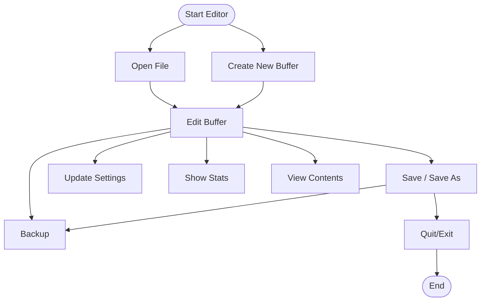

# 📝 Termux Notepad — Upgraded Terminal Editor

**Author:** Tech Vyana 2.0  
**Version:** 2.0  
**Environment:** Termux / Terminal-based (no GUI)

---

Termux Notepad is a feature-rich, command-line text editor designed for use within the Termux app or any Unix-like terminal. It offers essential note-taking and editing functionalities commonly found in GUI text editors—all available from the keyboard.

---

## 🚀 Overview

Termux Notepad enables developers, students, and keyboard-centric users to manage text files efficiently in a terminal. The tool is ideal for quick notes, scripting, or coding on mobile or desktop terminals.

---

## ⚙️ Installation

Follow these steps to set up Termux Notepad:

1. **Save the Script**
    - Save the provided Python code as:
    ```bash
    termux_notepad.py
    ```

2. **Make It Executable**
    ```bash
    chmod +x termux_notepad.py
    ```

3. **Run the Editor**
    ```bash
    ./termux_notepad.py
    ```
    or
    ```bash
    python3 termux_notepad.py
    ```

---

## 🧠 Features & Usage Examples

Termux Notepad offers a wide set of commands for file editing and management. Each command is entered at the prompt, using the syntax shown below.

### 1. 🆕 Create a New Buffer

- **Command:** `new`
- **Description:** Starts a new, blank note in memory.

```plaintext
[untitled]> new
New buffer created.
```

---

### 2. 📂 Open an Existing File

- **Command:** `open <filename>`
- **Description:** Loads an existing file for editing.

```plaintext
[untitled]> open todo.txt
Opened: /data/data/com.termux/files/home/todo.txt
```

---

### 3. 💾 Save and Save As

- **Commands:** `save`, `saveas <filename>`
- **Description:** Saves the current buffer to disk.

```plaintext
[untitled]*> saveas mytext.txt
Saved as: /home/user/mytext.txt
```

---

### 4. 👀 View with Optional Line Numbers

- **Command:** `view` (toggle line numbers: `linenumbers`)
- **Description:** Displays file content, with or without line numbers.

```plaintext
1: Hello World
2: This is Termux Notepad.
--- showing lines 1 to 2 of 2 ---
```

---

### 5. ✍️ Append / Insert / Replace / Delete Lines

- **Append:** `append` (type lines, finish with `.done`)
- **Insert:** `insert <line>` (specify line number)
- **Replace:** `replace <line>` (specify line number)
- **Delete:** `delete <line>` (specify line number)

| Action   | Example Command              | Example Output                             |
|----------|-----------------------------|--------------------------------------------|
| Append   | `append`                    | (Type text, end with `.done`)              |
| Insert   | `insert 3`                  | `Text to insert: New line inserted here.`  |
| Replace  | `replace 2`                 | `This is the new line 2.`                  |
| Delete   | `delete 4`                  | `Deleted line 4: Old text removed.`        |

---

### 6. 🔍 Find and Replace

- **Find:** `find <word>`
- **Replace All:** `replaceall <old> <new>`

Supports interactive replace (y/n/a/q options).

```plaintext
Replaced occurrences in 5 lines.
```

---

### 7. ⏪ Undo and Redo

- **Undo:** `undo`
- **Redo:** `redo`

```plaintext
Undo performed.
Redo performed.
```

---

### 8. 📊 Statistics

- **Command:** `stats`
- **Description:** Displays line, word, and character counts.

```plaintext
Lines: 15, Words: 123, Characters: 874
```

---

### 9. 🗂️ File Listing and Recent Files

- **List files in directory:** `list`
- **Show recent files:** `recent`
- **Open recent file:** `openrecent <index>`

---

### 10. 💾 Backups and Autosave

- **Manual backup:** `backup`
- **Autosave:** Automatically every few minutes (default: 180 seconds).
- **Backup location:** `~/.termux_notepad/backups`
- **Backup retention:** Up to 50 backups (default, configurable)

```plaintext
Backup created: ~/.termux_notepad/backups/myfile.txt.20251018_192045.bak
```

---

### 11. ⚙️ File Management

- **Delete:** `deletefile <filename>`
- **Rename:** `rename <old.txt> <new.txt>`
- **Copy:** `copy <src.txt> <dest.txt>`

---

### 12. 🧩 Settings & Customization

- **Show settings:** `settings`
- **Update setting:** `set <key> <value>`

| Setting                  | Example Value   |
|--------------------------|----------------|
| autosave_interval_sec    | 120            |
| keep_backups             | false          |
| max_undo                 | 100            |

```plaintext
Setting updated: autosave_interval_sec
```

---

### 13. 🧽 Clear Screen

- **Command:** `clear`

---

### 14. 🆘 Help

- **Command:** `help`
- **Description:** Lists all commands and usage.

---

### 15. 🚪 Quit

- **Command:** `quit`
- **Behavior:** Prompts to save or backup if there are unsaved changes.

---

## 🔁 Autosave & Backup Details

- **Autosave:** Triggers every configured interval (default: 180 sec).
- **Backup:** Stores copies in `~/.termux_notepad/backups`.
- **Limit:** Maximum backups kept (default: 50).

```plaintext
[autosave] buffer saved at 19:45:20
```

---

## 🔐 Signal Handling

If interrupted (e.g., Ctrl + C), the editor handles safe exits and prompts the user to save unsaved work.

```plaintext
[Interrupt] You have unsaved changes. Save now? (y/n):
```

---

## 🧰 Settings File Example

Settings are stored in JSON format at `~/.termux_notepad/settings.json`.

```json
{
  "autosave_interval_sec": 180,
  "max_undo": 60,
  "keep_backups": true,
  "backup_limit": 50
}
```

---

## 🧠 Example Workflow

```bash
$ python3 termux_notepad.py
Termux Notepad — upgraded (type 'help' for commands)
[untitled]> new
[untitled]> append
Hello World
This is my first note.
.done
[untitled]*> saveas notes.txt
Saved as: /home/user/notes.txt
[notes.txt]> stats
Lines: 2, Words: 7, Characters: 33
```

---

## 👩‍💻 Author

**Tech Vyana 2.0**  
*Building tools for smarter terminals and modern coders.*

---

## 📄 License

- **Open-source**
- Free for educational and personal use
- Modifications and redistribution allowed with credit to Tech Vyana 2.0

---

## 🛠️ Command Reference Table

| Command           | Action                                   |
|-------------------|------------------------------------------|
| new               | Create new buffer                        |
| open <file>       | Open file                                |
| save / saveas     | Save buffer / Save as new file           |
| view              | View file contents                       |
| append            | Append lines to buffer                   |
| insert <n>        | Insert at line n                         |
| replace <n>       | Replace at line n                        |
| delete <n>        | Delete line n                            |
| find <word>       | Find word                                |
| replaceall        | Replace all occurrences                  |
| undo / redo       | Undo / redo last change                  |
| stats             | Show buffer statistics                   |
| list              | List files in directory                  |
| recent            | Show recently opened files               |
| openrecent <n>    | Open recent file by index                |
| backup            | Manual backup                            |
| deletefile        | Delete a file                            |
| rename            | Rename a file                            |
| copy              | Copy file                                |
| settings          | Show settings                            |
| set <k> <v>       | Update setting                           |
| clear             | Clear screen                             |
| help              | Show help                                |
| quit              | Exit editor                              |

---

## 🗺️ Editing Workflow (Flowchart)

Below is a diagram showing the main editing workflow:



---

## 💡 Summary

Termux Notepad brings the flexibility and speed of command-line editing to your terminal. It provides a comprehensive, keyboard-driven interface for text editing, file management, and customization. It is robust, customizable, and tailored for users who want to stay productive without leaving the terminal.

---

**Happy editing!** 🚀